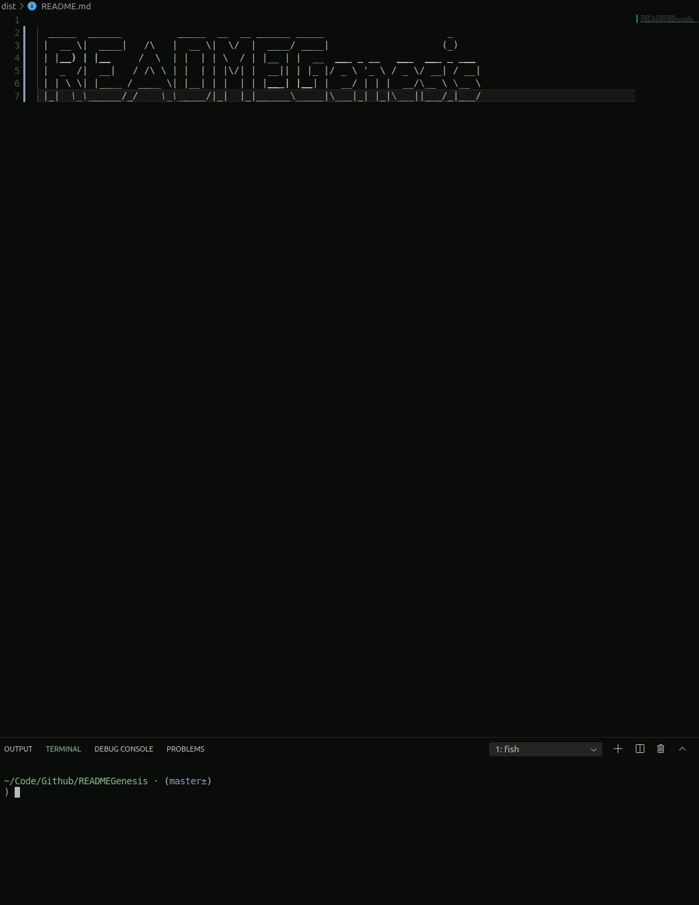

## READMEGenesis

Menu driven command line utility written in Node.js to generate a professional README for new projects.

#### Issues

- [x] [Generate Basic README File](https://github.com/MBrassey/READMEGenesis/issues/1)
- [x] [Add Logic & Prompt for More Info](https://github.com/MBrassey/READMEGenesis/issues/2)
- [x] [Enhance README Template for Variable Content](https://github.com/MBrassey/READMEGenesis/issues/3)
- [x] [Generate Entire README](https://github.com/MBrassey/READMEGenesis/issues/4)
- [x] [Finishing Touches](https://github.com/MBrassey/READMEGenesis/issues/5)

#### Table of Contents

* [Requirements](#Requirements)
* [Installation](#Installation)
* [Usage](#Usage)
* [Screenshot(s)](#Screenshots)
* [Questions](#Questions)

#### Requirements

    node
    npm

#### Installation

    npm i

#### Usage

    Usage: node app.js [ -h | -v | -l | -a ]
     
    [options]
     
           -h          Display this message.
           -v          Show version.
           -l          Show license info.
           -a          What is READMEGenesis?

<h6>
:cyclone: Click the image(s) below to view the live <a href="https://MBrassey.github.io/READMEGenesis/">webapplication</a>
</h6>

[
](https://MBrassey.github.io/READMEGenesis/)

#### Questions
Contact me at [matt@brassey.io](mailto:matt@brassey.io) with any questions or comments. 
